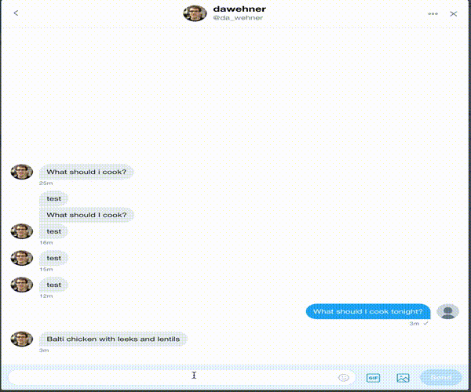

## Contenta recipe bot

One major advantage of a decoupled approach is to have a rich data model, which
can be accessed from more places.

These days a really hiped feature are chatbots. This project provides one example
implementation using [botmaster.ai](http://botmasterai.com/documentation/latest/).
Please experiment with other tools, and please join the #contenta slack 

 

## Setup

* Set up .env variables
* Start the bot using ```node bot.js```
* Try to interact with the bot

## Interaction

* What should I cook?
* What are the ingredients?
* Show me the instructions!

## Features

* Twitter support
* More integrations to come
* Commands: Get a random recipe
